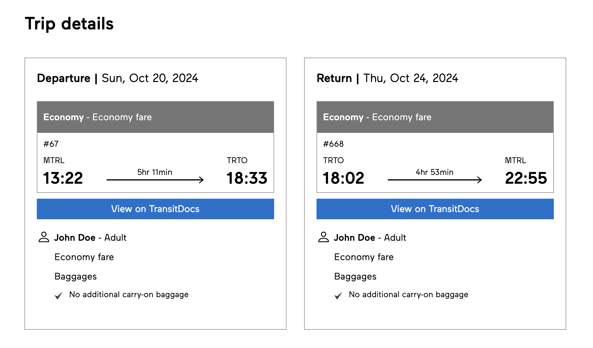

# VIA Rail Trip Insights Chrome Extension

This Chrome extension enhances VIA Rail's booking interface by injecting a **"View on TransitDocs"** button into each trip segment. It enables users to quickly investigate the historical performance of a train on a given day.

Useful when you have a lot of bookings and have lost track of which ones were **delayed
more than 1 hour** so you can claim your 50% discount on future bookings.



## 🔧 Installation

1. Clone or download this repository to your computer.
2. In Chrome, open `chrome://extensions/`.
3. Enable **Developer mode** (toggle in the top right).
4. Click **Load unpacked** and select the folder containing this extension.

## 🧠 How It Works

* The script observes the page for any trip segments added dynamically.
* For each `app-trip-summary-segment`, it extracts:

  * The train number from the `.trip-head` element.
  * The travel date from the `.trip-summary p.date` element.
* A button is injected that, when clicked:

  * Opens a new tab pointing to the train’s record on TransitDocs for further inspection.

Example URL pattern:

```
https://asm.transitdocs.com/train/YYYY/MM/DD/V/###
```
